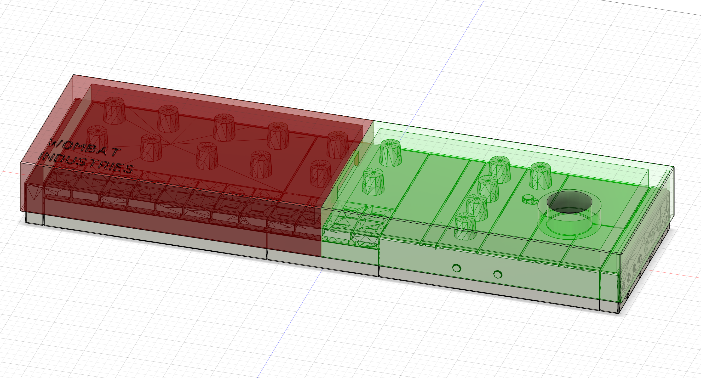
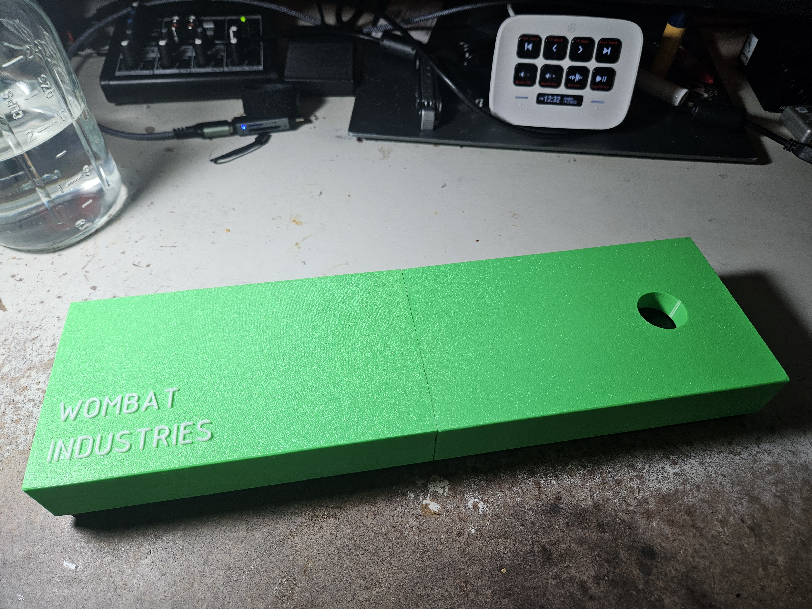
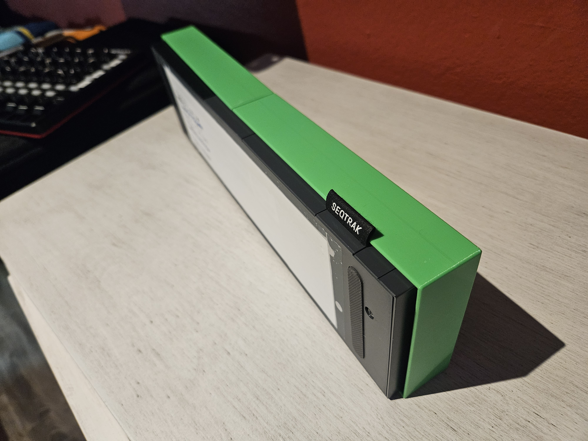
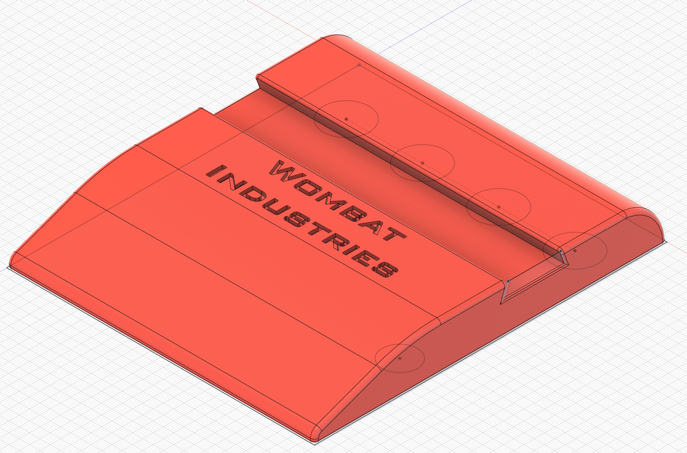

# Charity Cases

## Seqtrak Cases 

I will, at my expense, print and ship a Seqtrak protective case to you, on the **pledge** you'll donate an appropriate amount of money to a **food bank**.  

Suggested donations are:

 + $35+: Black with either blank face, or "Wombat Industries" as seen in the pictures.
 + $40+: You pick the color.
    + I have Green, White, Yellow, Gray, Black, Orange, White, Red and Blue. 
 + $50+: Custom lettering (includes custom color)
 
 Please reach out if you have any ideas!

## How do I join in on this absurd idea?

Email me at [**WombatIndustries@proton.me**](mailto:WombatIndustries@proton.me), your desired configuration and address and I'll send it out.  

**Please** email me back when you get the case, and let me know you got it, that it's indeed awesome, any feedback, and pretty-please confirm you've donated to a food bank.  This lets me know this crazy idea is working, and gives me the strength to carry on :)

You will need to glue the two parts together using super glue (which works like gangbusters on PETG). Pre-gluing them would require a more expensive, bigger, box.  

## The case

Printed from PETG, it protects the side buttons, and has internal structure to protect the encoder knobs and JANKY JANKY SEQTRAK keys.  A piece of felt provides compliance, and the entire case pressure fits around the seqtrak.   The hole in the top allows pushing the Seqtrak out from the top and creates whimsical thoughts.

### TODO Black images

**note**: they've been ever so slightly modified to fit in a USPS flat rate box.

## FAQ

### Why are you doing this?

After creating this design, I had a handful of people ask for an etsy page to buy one.  I don't really want to start a printing business, but I do want to help people, and share my **glorious** case.

My local foodbank claims $35 makes up to 175 meals.  That's a lot of meals.  A big portion of people who need food banks are elderly, children, or elderly taking care of children.  

### What ensures I actually donate to a Food Bank?

Absolutely nothing, other than honor, guilt, pride, etc...  I have a hunch more people will opt to donate **MORE** than the suggested amount than people will take advantage of this generous offer!

### I'm too lazy to look up a foodbank, can you suggest one? 

Yes. My local food bank (which does a great job) is [**RoadRunner Foodbank of New Mexico**](https://give.rrfb.org/give/503168/#!/donation/checkout?eg=true).  New Mexico is definitely on the list of states that really need help.

### Are there any other cases I can score?

Currently 2 are planned: an Sp404Mk2, and an Ableton Move.  email me if you want to get notified if they ever get completed.

SP404Mk2 is in the works:

